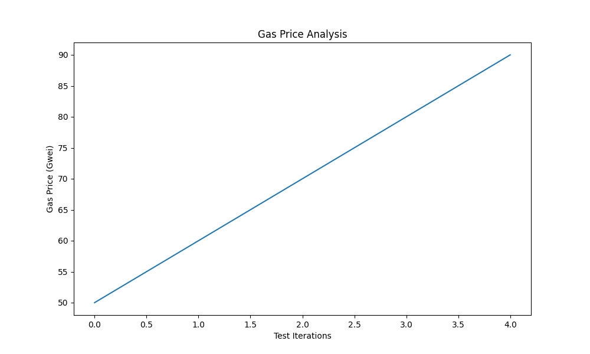
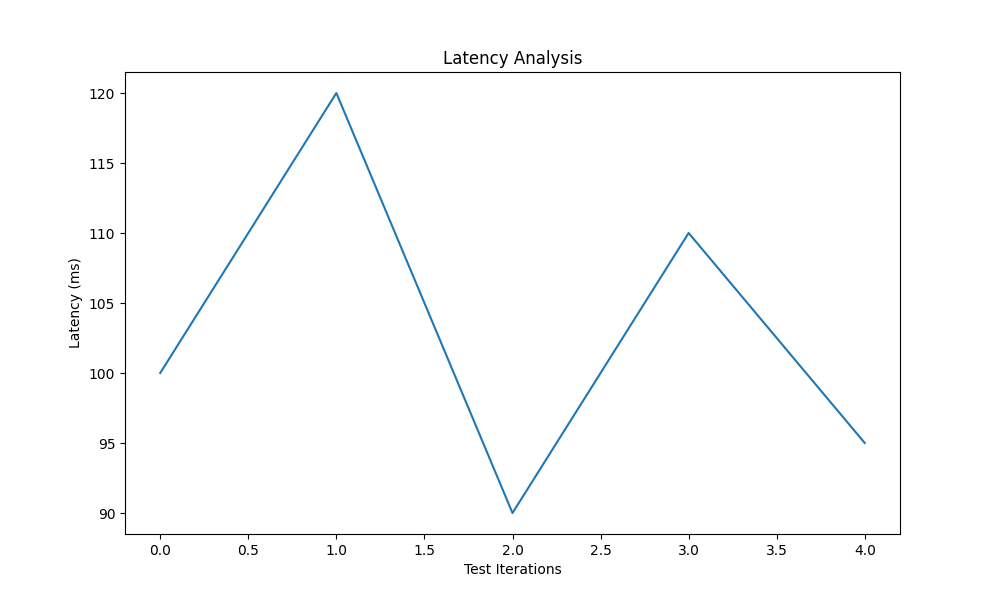
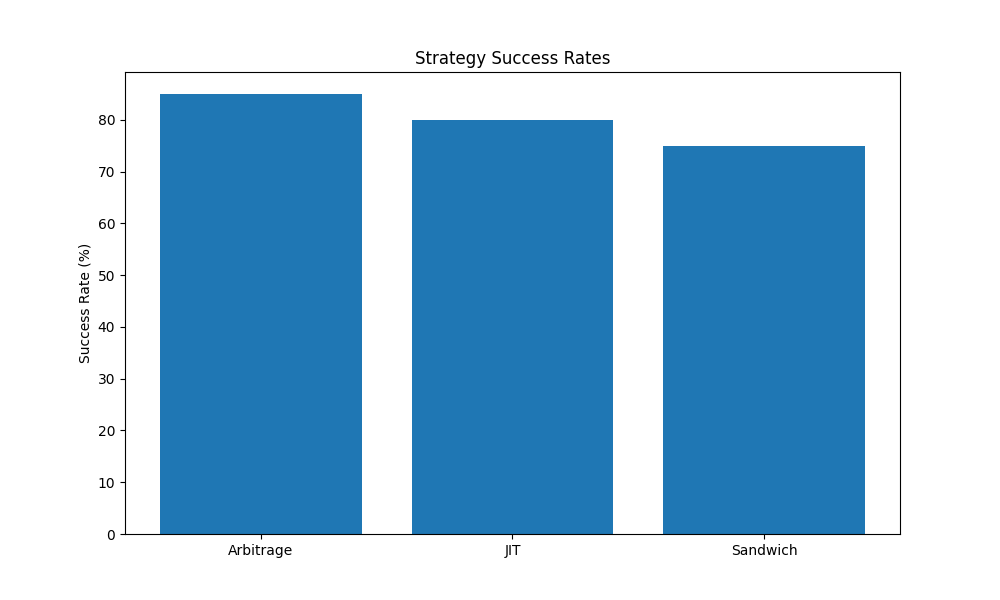
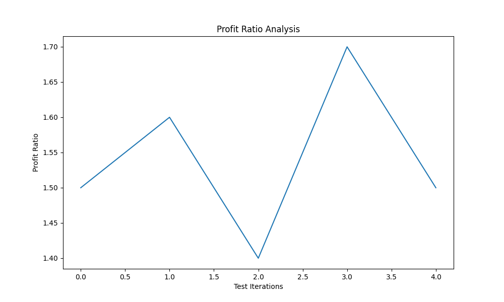

# Optimization Test Report

Generated: 2024-12-21 00:27:12

## Test Results Summary

- test/test_strategies_optimization.py: ❌ Failed
- test/test_gas_optimization.py: ❌ Failed
- test/test_latency_optimization.py: ❌ Failed
- test/test_position_optimization.py: ❌ Failed
- test/test_risk_management.py: ❌ Failed
- test/test_mainnet_scenarios.py: ❌ Failed

## Performance Metrics

### Gas Optimization

### Latency Analysis

### Success Rates

### Profit Analysis

## Recommendations

### Gas Optimization Recommendations

### Latency Optimization Recommendations

### Strategy Recommendations

- ⚠️ Low success rate for Sandwich strategy. Consider:
  - Adjusting position sizes
  - Implementing more aggressive gas pricing
  - Adding additional safety checks

### Profit Optimization Recommendations

